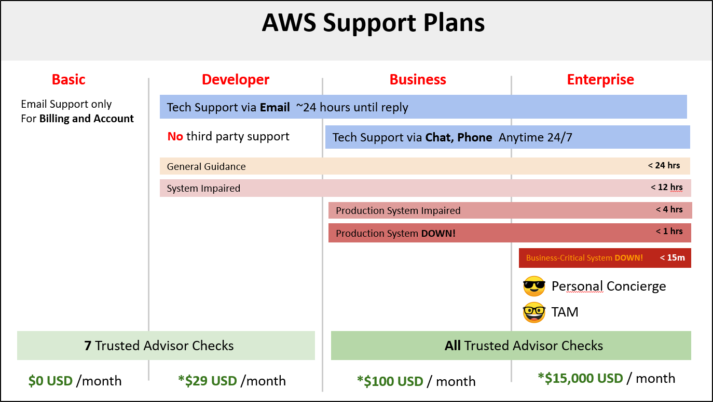
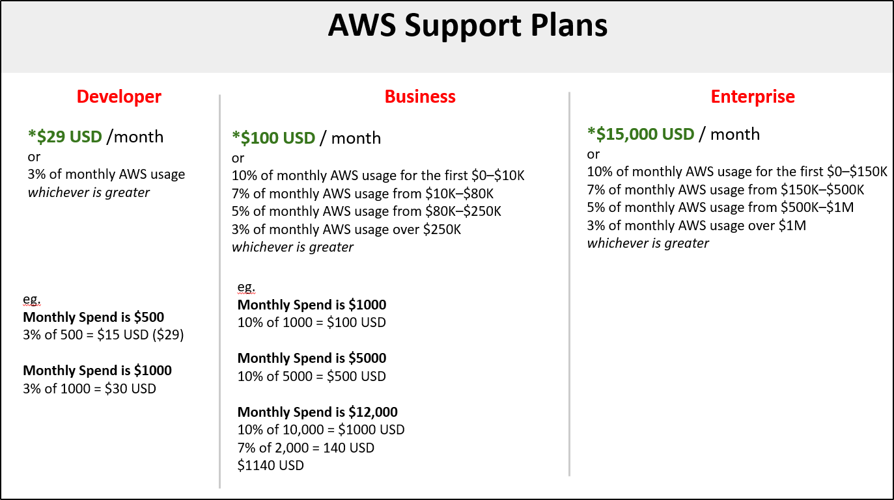
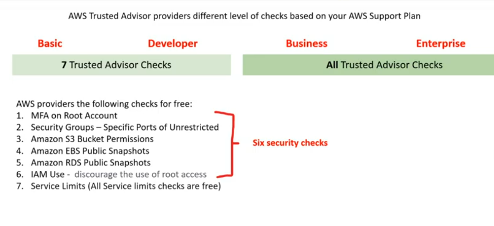

## AWS Free Services

AWS Free services are free forever, unlike the “free-tier” that are up to a point of usage or time

The AWS services are also free. However these AWS Services provision other services which may cost money

* IAM - Identity Access Management
* Amazon VPC
* Auto Scaling
* CloudFormation (pulls up VM'S which cost money)
* Elastic Beanstalk
* Opsworks
* Amplify
* AppSync
* CodeStar
* Organizations & Consolidated Billing
* AWS Cost Explorer 

----

## AWS Support Plans

----

## Consolidated Billing

**Consolidated Billing** is a feature of AWS Organizations that allows you to pay for multiple AWS accounts with one bill.

For billing, AWS treats all the accounts in an organization as if they were one account.

You can designate one master account that pays the charges of all the other member accounts.

Consolidated billing is offered at no additional cost!

Use **Cost Explorer** to visualize usage for consolidated billing

You can combine the usage across all accounts in the organization to share the volume pricing discounts

----

## AWS Trusted Advisor

AWS Trusted Advisor is a recommendation tool that automatically and actively monitors your AWS account to provide actional recommendations across a series of categories.

Think of AWS Trusted Advisor like an automated checklist of best practices on AWS

The 5 categories of AWS Trusted Advisor

* Cost Optimization - How can we save money?
* Performance - How can improve performance?
* Security - How we can improve security?
* Fault Tolerance - How can we prevent a disaster or data loss?
* Service Limits - Are we are going to hit the maximum limit for a service? 

AWS Trusted Advisor providers different levels of checks based on your AWS Support Plan

Basic

Developer

* 7 Trusted Advisor Checks 

Business

Enterprise

* All Trusted Advisor Checks 

AWS providers the following checks for free:

* MFA on Root Account
* Security Groups - Specific Ports of Unrestricted
* Amazon S3 Bucket Permissions
* Amazon EBS Public Snapshots
* Amazon RDS Public Snapshots
* IAM Use - Discourage the use of root access
* Service Limits (All Service limits checks are free) 

----

## Service Level Agreements

### What is a Service Level Agreement (SLA)?

    An SLA is a formal commitment about the expected level of service between a customer and provider.

    When a service level is not met and if the Customer meets its obligations under the SLA, Customer will be eligible to receive the compensation eg. Financial or Service Credits

### What is a Service Level Indicator (SLI)?

    A metric/measurement that indicates what measure of performance a customer is receiving at a given time

    An SLI metric could be uptime, performance, availability, throughput, latency, error rate, durability, correctness

### What is a Service Level Objective (SLO)?

    The objective that the provider has agreed to meet

    SLOs are represented as a specific target percentage over a period of time.

----

## AWS Free-Tier

AWS has a free-tier that allows you to use AWS at no cost

* For the first 12 months of signup
* Or free usage up to a certain monthly limit forever 

### EC2 Web Server 

* t2.micro 750 hours per month for 1 year 

RDS Database (MySQL or Postgres) 

* t2.db.micro 750 hours per month for 1 year 

### ELB Load Balancer 

* 750 hours per month for 1 year 

### Amazon CloudFront  Homepage Video

* 50 GB data-transfer out in total for 1 year 

### Amazon Connect Toll-Free Number

* 90 minutes of call-time per month for 1 year 

### Amazon ElastiCache Caching

* cache.t3.micro 750 hours per month for 1 year 

----

### Amazon ElasticSearch Service Full-Text Search

* 750 hours per month for 1 year  

### PinPoint Campaign / Marketing Emails

* 5,000 targeted users per month for 1 year 

### SES Emails sent by your web-application

* 62,000 emails per month forever 

### AWS CodePipeline CI/CD

* 1 Pipeline free 

### AWS CodeBuild Building Code

* 100 build minutes per month forever 

### AWS Lambda Serverless Compute

* 1M free request per month
* 3.2M seconds of compute time per month 

----

## AWS Budgets

AWS Budgets give you the ability to set up alerts if you exceed or are approaching your defined budget

* Create Cost, Usage, or Reservation Budgets

It can be tracked at the monthly, quarterly, or yearly levels, with customizable start and end dates

* Alerts support EC2, RDS, Redshift, and ElastiCache reservations.

AWS Budgets can be used to Forecast costs but is limited compared to Cost Explorer or doing your analysis with AWS Cost and Usage Reports along with a Business Intelligence tool

* Budget based on a fixed cost or plan your upfront based on your chosen level

Can be easily managed from the AWS Budgets dashboard or via the Budgets API.

* Get Notified by providing an email or Chatbot and threshold how close to the current or forecasted budget

e.g

You have a list of budgets:

You can see your budget history, download it as a CSV

* first two budgets are free of charge
* Each budget is $0.02 per day ~0.60 USD / month
* 20,000 budgets limit 

----

## AWS Cost Explorer

AWS Cost Explorer lets you visualize, understand, and manage your AWS costs and usage over time.

* Specific type range and aggregation

* Robust filtering

Default reports help you gain insight into your cost drivers and usage trends.

* Use forecasting to get an idea of future costs

* Choose if you want to view your data at a monthly or daily level of granularity

* Use filter and grouping functionalities to dig even deeper into your data!

* Cost Explorer shows up in US-East-1

